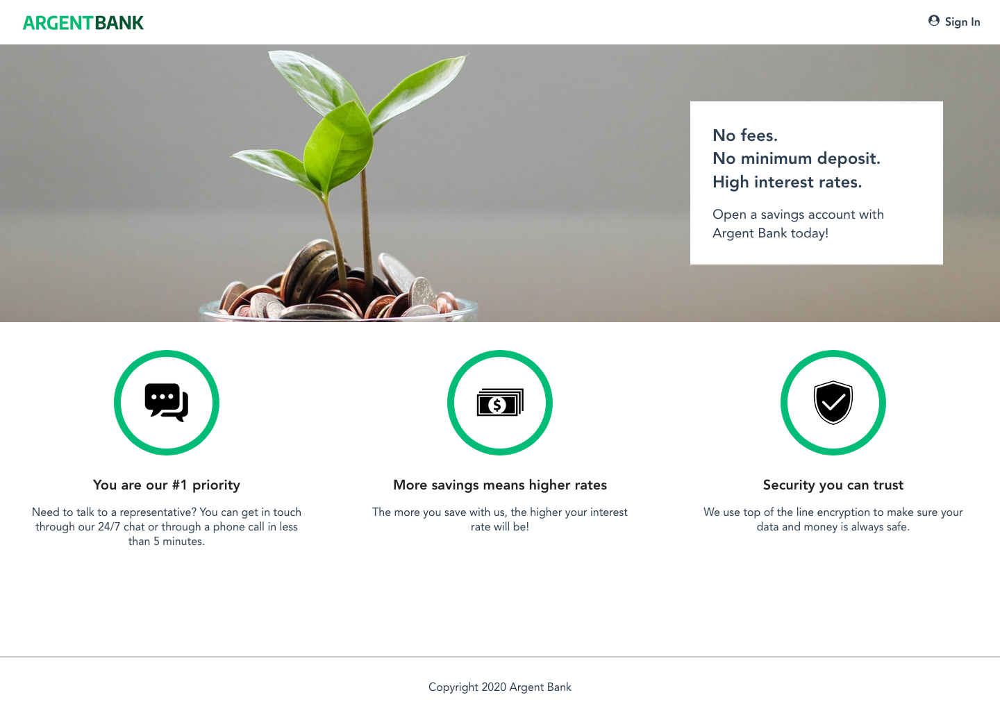
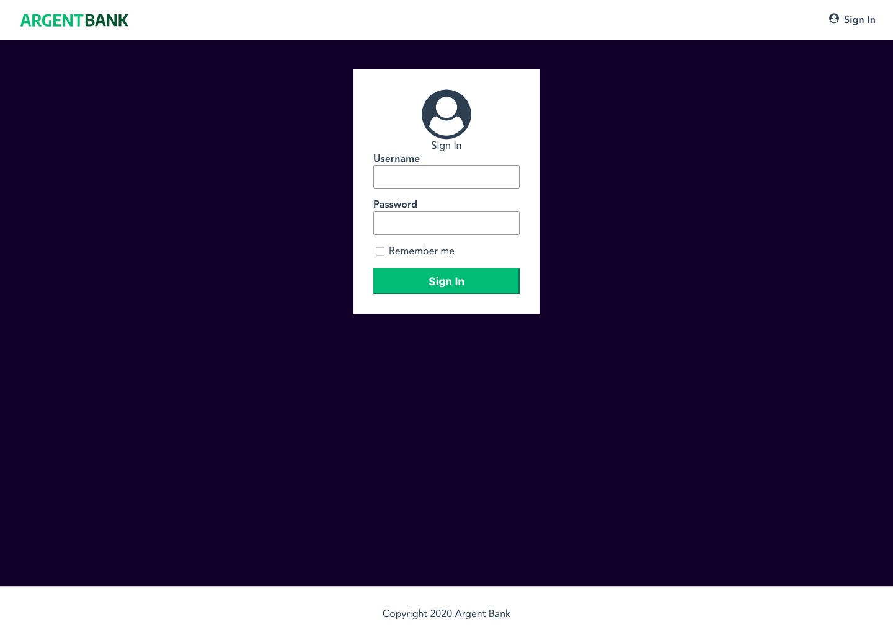
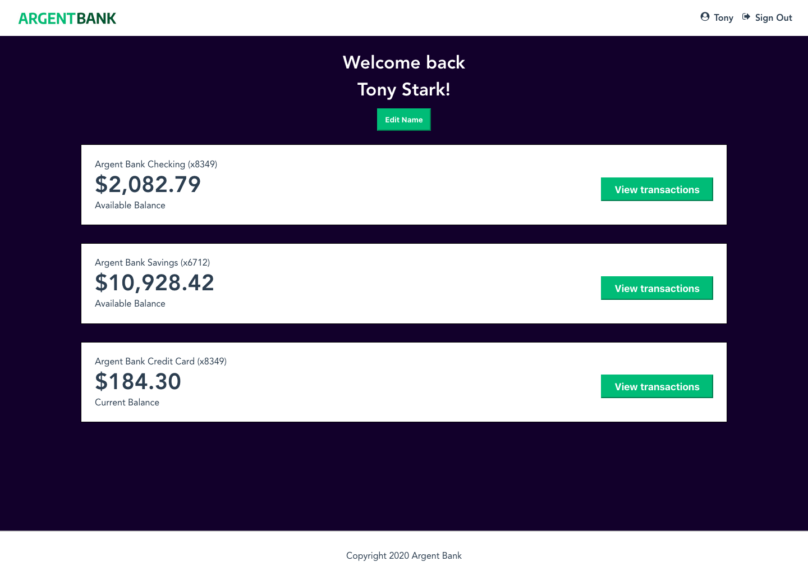

# OpenClassrooms - Projet 13 ArgentBank

## 📖 Sommaire
- [📌 Description](#-description)
- [👀 Aperçu](#-aperçu)
- [⚙️ Installation](#-installation)
- [▶️ Utilisation](#-utilisation)
- [🏗 Architecture de l'application](#-architecture-de-lapplication)
- [🛠️ Technologies utilisées](#-technologies-utilisées)
- [👀 Aperçu](#-aperçu)
- [⚠️ Avertissement sécurité](#-avertissement-sécurité)

---

## 📌 Description

Code source du **Projet 13 - ArgentBank** : *Utilisez une API pour un compte utilisateur bancaire avec React*, issu du parcours **Développeur d'application JavaScript React** chez OpenClassrooms.

### 🎯 Objectifs pédagogiques
- S'authentifier à une API
- Implémenter un gestionnaire d'état dans une application React
- Interagir avec une API
- Modéliser une API

### 🔗 Ressources de départ
- [Maquette HTML et CSS statique](https://github.com/OpenClassrooms-Student-Center/Project-10-Bank-API/tree/master/designs)
- [Liste de features à implémenter](https://github.com/OpenClassrooms-Student-Center/Project-10-Bank-API/tree/master/.github/ISSUE_TEMPLATE)
- [Back-end API](https://github.com/OpenClassrooms-Student-Center/Project-10-Bank-API)
- [Documentation Recharts pour l'implémentation des graphiques](https://recharts.org/en-US/storybook)

---

## 👀 Aperçu

| 🏠 Page d’accueil                  | 🔑 Page de connexion              | 🧑‍💻 Profil utilisateur             |
|------------------------------------|-----------------------------------|--------------------------------------|
|  |  |  |


---

## ⚙️ Installation

### 📋 Prérequis
- [Node.js](https://nodejs.org/) **>= 18**
- npm (fourni avec Node.js)

### 🚀 Étapes d'installation

> Toutes les commandes précitées ci-dessous s'exécutent à la racine du repo.

#### Prérequis

> Le front-end utilise la **version 20 de** [**Node.js**](https://nodejs.org/en/).

> Le back-end provient du [repo non maintenu d'OpenClassrooms](https://github.com/OpenClassrooms-Student-Center/Project-10-Bank-API), dépendance des technologies et verisons suivantes:
>
> - **Version 12 de** [**Node.js**](https://nodejs.org/en/).
> - [**MongoDB Community Server**](https://www.mongodb.com/try/download/community)


```bash
# Clonez le projet
git clone <url-du-repo>
```

Back-end:

```bash
# Se placer dans le répertoire du back-end
cd ./back/

# Installer les dépendances du back-end
nvm use 12
npm install

# Initialiser la base de données MongoDB avec 2 utilisateurs
npm run populate-db
```

Front-end:

```bash
# Se placer dans le répertoire du front-end
cd ./front/

# Installer les dépendances du front-end
nvm use 20
npm install
```

---

## ▶️ Utilisation

### Lancement du back-end

```bash
cd ./back/
nvm use 12
npm run dev:server
```

### Lancement du front-end

#### Développement
```bash
cd ./front/
nvm use 20
npm run dev
```
→ Lance l’application React avec **Vite** en mode développement.

#### Production
```bash
cd ./front/
nvm use 20
npm run build
```
→ Génère un dossier `dist/` contenant les fichiers optimisés pour la production.

Pour prévisualiser le build localement :
```bash
npm run preview
```

---

## 🏗️ Architecture de l'application

### 1. Point d'entrée
- `src/main.jsx` : initialise React, monte l’application dans le DOM, configure le router et Redux
- `src/router.jsx` : logique de routing de l’application
- `src/redux.js` : store Redux global et reducers
- `src/mainConfig.js` : variables de configuration (ex. URL API)

### 2. Structure générale
- `src/layouts/Layout.jsx` : layout global, inclut la logique d’authentification (⚠️ cookies côté front uniquement pour démonstration pédagogique, **non sécurisé en production**)
- `src/pages/` : pages de l’application
- `src/components/` : composants réutilisables
- `src/services/` : gestion des appels API & cookies
- `src/scss/` : styles SASS (structure 7-1), compilés en CSS dans `style/main.css`

---

## 🛠️ Technologies utilisées

### 📦 Dépendances de production
- React ^19.1.0
- React DOM ^19.1.0
- React Router DOM ^7.7.1
- Redux Toolkit ^2.8.2
- React Redux ^9.2.0
- Sass ^1.89.2

### 🛠️ Dépendances de développement
#### 🔧 Build & Plugins
- Vite ^7.0.4
- @vitejs/plugin-react ^4.6.0

#### ✨ Typages
- @types/react ^19.1.8
- @types/react-dom ^19.1.6

#### 🧹 Linting / Qualité de code
- ESLint ^9.30.1
- @eslint/js ^9.30.1
- eslint-plugin-react-hooks ^5.2.0
- eslint-plugin-react-refresh ^0.4.20
- globals ^16.3.0
- Prettier 3.6.2

---

## 📜 Scripts disponibles

| Commande           | Description                                    |
|--------------------|------------------------------------------------|
| `npm run dev`      | Lance le serveur de développement Vite         |
| `npm run build`    | Construit le projet pour la production         |
| `npm run preview`  | Prévisualise le build de production localement |
| `npm run lint`     | Vérifie la qualité du code avec ESLint         |
| `npm run sass`     | Compile les fichiers SCSS en CSS (watch mode)  |
| `npm run prettier` | Formate automatiquement le code avec Prettier  |

---

## ⚠️ Avertissement sécurité
L’authentification par cookies implémentée ici est à but **strictement pédagogique** dans le cadre d'un **projet de formation**.  
👉 En production, utiliser des **cookies httpOnly** côté serveur pour éviter toute faille XSS.
